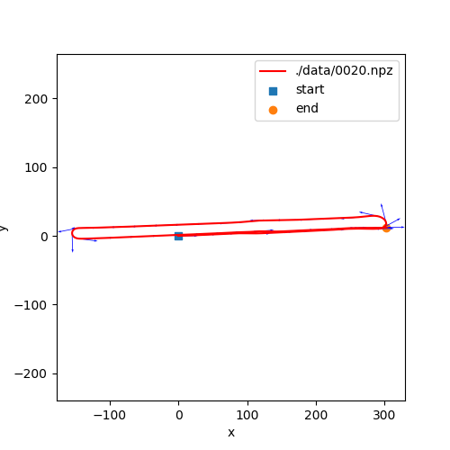
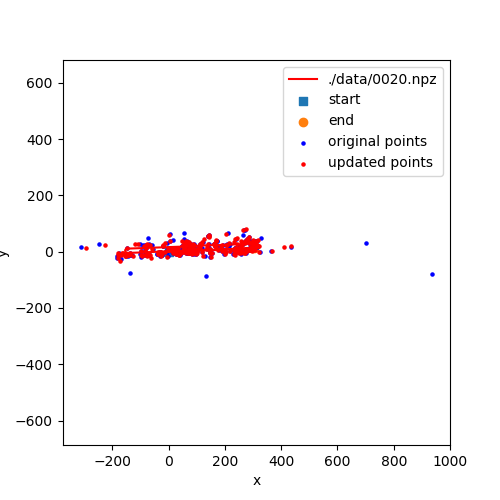
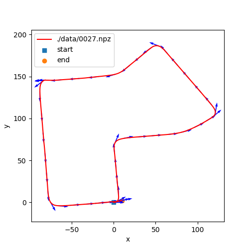
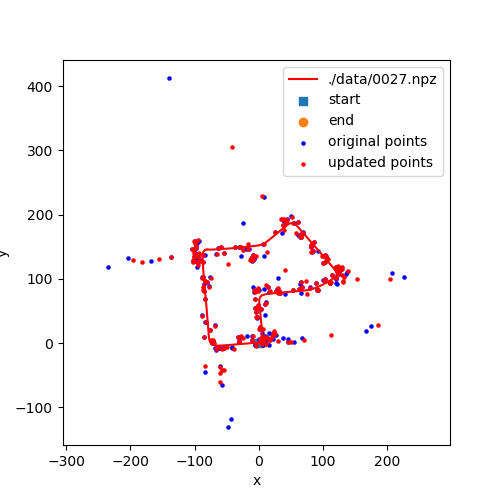
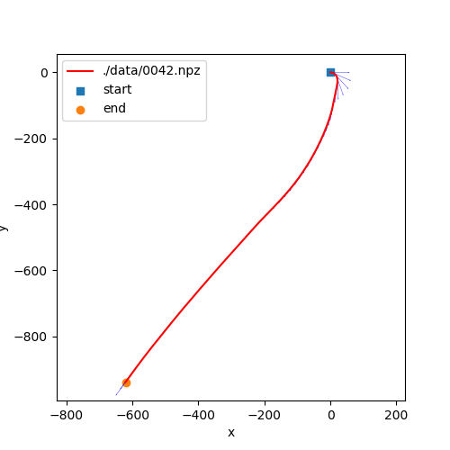
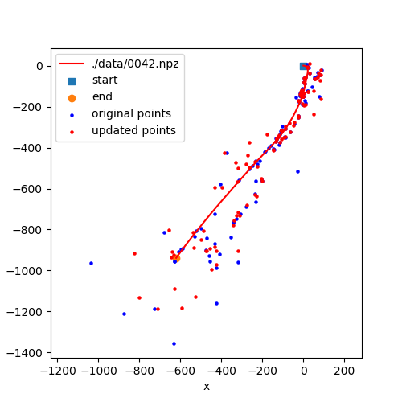

# Visual-inertial-SLAM-with-Extended-Kalman-Filter

Run the main file and choose datasets. There are three datasets for testing.

Results of Dataset 20:

  
   

Results of Dataset 27:

  
   

Results of Dataset 42:

  
   

